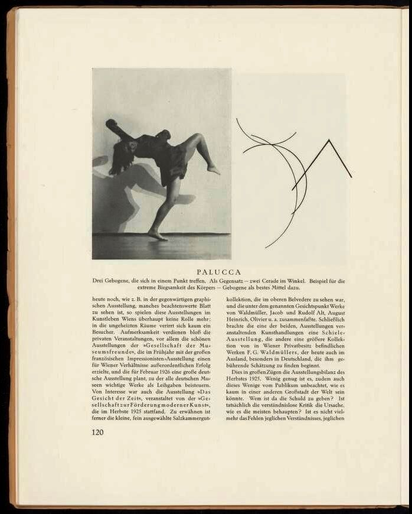

# movement architecture experiments 
This project is inspired by Wassily Kandinsky's "Dance Curves: On the Dances of Palucca" (1926), where he translated dancer Gret Palucca's movements into abstract geometric forms and flowing lines. The work explores the intersection of embodied movement and computational visualization

  

## 1. motion capture 
- uses MediaPipe pose detection to track 15 key body landmarks in real-time
- pose_tracking.py script captures dance movements from webcam or video files
- exports trajectory data as JSON for visualization

## 2. visualization 
- processing sketch renders movement trajectories as flowing lines 
- controls: R = reset, P =togle pose on/off 